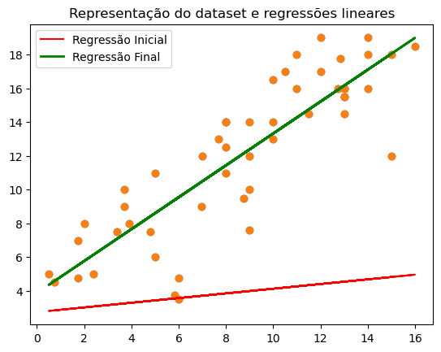

---

# **Projeto: Regressão Linear**

Este repositório contém uma implementação de um algoritmo de Regressão Linear apenas com o uso da biblioteca _numpy_.

## **Descrição**

### **Gradiente Descendente**

O algoritmo de Regressão Linear é um método de aprendizagem supervisionada, cujo objetivo é encontrar a relação linear entre a(s) feature(s) e o output da função que melhor se ajusta aos dados, permitindo prever valores de ouput no futuro com base na informação disponível das diferentes features.

O modelo de Regressão Linear pode ser definido pelas seguintes funções (dependendo se temos apenas 1 feature - simples -, ou mais do que 1 feature - múltipla):

    Regressão Linear Simples : f_wb = w * x + b

    Regressão Linear Múltipla: f_wb = $\overrightarrow{w}$ . $\overrightarrow{x}$ + b

Neste projeto, a otimização dos parâmetros de w e b de maneira a encontrar a regressão que melhor se ajusta aos dados vai ser feita através de **Gradiente Descendente**, algoritmo bastante utilizado para encontrar o mínimo de qualquer função, especialmente quando as funções são convexas, uma vez que deixámos de ter o problema de ficar retidos em mínimos locais.

Começando em parâmetros de w e b aleatórios, o Gradiente Descendente encontra o declive da função de custo nesses pontos (através da derivada da função de custo em relação aos parâmetros de w e b - dcdw e dcdb, respetivamente), e vai ajustar iterativamente w e b de maneira a minimizar a função de custo. O tamanho deste ajuste vai depender de um hiperparâmetro _learning rate_ definido a priori.

    w_new = w_prev - learning rate * dcdw

    b_new = b_prev - learning rate * dcdb
    
O algoritmo converge assim que encontra o mínimo da função de custo, momento em que w_new = w_prev e b_new = b_prev, e deixa de haver atualizações dos parâmetros w e b. Neste projeto, o utilizador é também capaz de definir as seguintes condições de paragem: número de iterações, erro mínimo observado na função de custo, alterações mínimas dos parâmetros de w e b.

### **Etapas do Projeto**

Assim sendo, a implementação de Regressão Linear através do Gradiente Descendente vai-se dar pelos seguintes passos:

1) Inicialização dos parâmetros de w e b de maneira aleatória.

2) Cálculo da Função de Custo, que no nosso caso vai ser a _Mean Squared Error Function_ (MSE), que mede o erro médio entre os valores previstos pelo modelo e os valores reais observados.

3) Atualização dos parâmetros de w e b através da intuição de Gradiente Descendente.

4) O modelo irá convergir quando alguma das 4 condições é alcançada: já não há ajustes possíveis para w e b; número máximo de iterações do modelo atingido; erro mínimo observado na função de custo; alterações mínimas dos parâmetros de w e b.

## **Aplicação prática do projeto**

Para demonstrar a aplicabilidade do projeto, pedi ao ChatGPT que me fornecesse um dataset de 50 pontos de dados representativo das horas de estudo de 50 alunos para um determinado exame e das suas respetivas notas - variáveis horas_estudo e nota_exame. Utilizei apenas 1 feature (horas_estudo) de maneira a conseguirmos inspecionar graficamente a regressão. 

Através da aplicação da regressão linear construída em Projeto_Programming.py, vamos obter uma relação linear entre as variáveis horas_estudo e nota_exame, permitindo no futuro formar previsões da nota de um aluno no exame consoante as horas que estudou para o mesmo.

linear_regression(horas_estudo,nota_exame, learning_rate = 0.01, n_iterations = 20000, min_error = 1e-12, min_update = 1e-12)

Nes

A representação inicial de y_hat = 0.754382512814484 x + 2.0747390242764743
Paragem na iteração 11580 porque as alterações em w e b já não são maiores do que 1e-12.
O ótimo da regressão está definido em y_hat = 0.9448042025017789 x + 3.878528693150314

