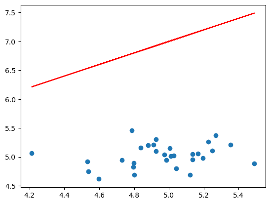
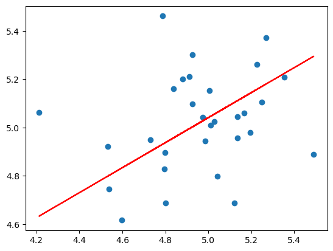

---

# **Projeto: Regressão Linear**

Este repositório contém uma implementação de um algoritmo de Regressão Linear apenas com o uso da biblioteca _numpy_.

## **Descrição**

O algoritmo de Regressão Linear é um método de aprendizagem supervisionada, cujo objetivo é encontrar a relação linear entre a(s) feature(s) e o output da função que melhor se ajusta aos dados, permitindo prever valores de ouput no futuro com base na informação disponível das diferentes features.

## **Aplicação**

